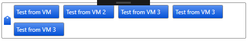

Alternative version of Kai Timmermann's WPF control to add/remove/edit tags/tokens
    
    Differences:
      - Can be databound to any object (using Tags and DisplayMemberPath)
      - Scrollable view when there are two many Tags
      - Can be styled/themed to change the color, foreground and tags background
      - Tags are added via the datamodel not through the control itself

## Getting Started

First import the package to all the relevant projects

    Import-Package AltWPFTagControl

In the App.xaml import the template dictionary

       <ResourceDictionary>
            <ResourceDictionary.MergedDictionaries>
                <ResourceDictionary Source="pack://application:,,,/WPFTagControl;component/Themes/ColorsAndIcons.xaml" />
            </ResourceDictionary.MergedDictionaries>
        </ResourceDictionary>

In your view model, create an observable collection of the objects you want to use for tags

          Tags = new ObservableCollection<Thing>()
            {
                new Thing()
                {
                    Name = "Tag 2",
                    Value = 1,
                },
            };

Added the namespace to your window or controls

    xmlns:cont="clr-namespace:WPFTagControl;assembly=WPFTagControl"

Lastly Add the control to the layout

            <cont:TagControl x:Name="ctl_Tags" BorderBrush="Gray" BorderThickness="1"
                         VerticalAlignment="Stretch" Tags="{Binding Tags}"
                         DisplayMemberPath="Name"
                         MaxHeight="74">
        </cont:TagControl>

Use the `Tags` property on `TagControl` to bind the items to the control and `DisplayMemberPath` to determine what property is used for the tag text

## Styling

You can override the styling by providing alternatives to the resources list below. This can be done in the App.xaml or with the usercontrol or host controls.

    <SolidColorBrush x:Key="TagHighlightBrush" Color="White" />

    <SolidColorBrush x:Key="TagForegroundBrush" Color="White"/>

    <LinearGradientBrush x:Key="TagBackgroundBrush" EndPoint="0,1">
        <GradientStop Offset="0" Color="#5890f0" />
        <GradientStop Offset="1" Color="#0351d7" />
    </LinearGradientBrush>